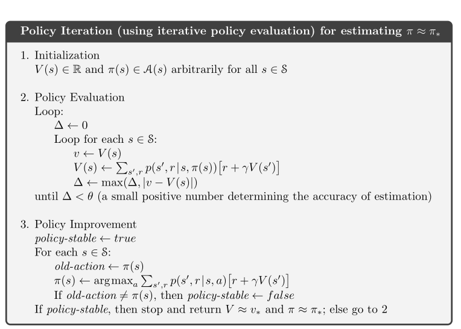
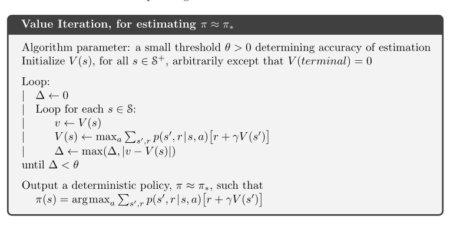

# Preambule

*   **Author** : Ayoub Choukri
*   **Date** : 05/04/2024
# Lancement du programme

**Pour lancer le programme,il suffit d'exécuter le script launch.sh. Ce pendant, il faut modifier le nom de l'environnement virtuel dans le script launch.sh et installer les dépendances nécessaires.**

# Introduction

<div style="background-color:rgba(0, 0, 255, 0.1); padding:15px;margin:5px">

Ce projet est un projet personnel que j'ai réalisé afin de m'initier aux premiers algorithmes de bases en **Reinfocement Learning**. J'ai choisi de travailler sur le jeu du **Tick-Tack-Toe** (ou Morpion) car c'est un jeu simple et connu de tous. 

La particularité de ce jeu est qu'il nécessite deux joueurs pour jouer. Il faut donc, prendre en compte la réponse de l'adversaire pour prendre une décision. Cela rend le jeu plus complexe que les jeux à un seul joueur. 

Bien que le jeu du **Tic_Tac_Toe** soit un jeu simple qu'on peut résoudre à travers des algorithmes d'intelligence artificielle dite **symbolique**, il est intéressant de l'aborder en utilisant des algorithmes de **Reinforcement Learning**.


J'ai essayé de créer une classe qui imite en quelques sorte les aspects d'un environnement de type OpenAI Gym. J'ai ensuite implémenté les algorithmes du **Policy Iteration** et de la **Value Iteration** pour résoudre le jeu.

</div>

## Lancement du programme

Pour lancer le programme,il suffit d'exécuter le script launch.sh qui se trouve dans le dossier **site**. Ce pendant, il faut modifier le nom de l'environnement virtuel dans le script launch.sh et installer les dépendances nécessaires.


## Les différentes parties du projet
<div style="background-color:rgba(0, 0, 255, 0.1); padding:15px;margin:5px"
Les différentes parties de ce projet sont les suivantes:
*   **train.py**: Ce fichier est utilisé pour exécuter les algorithmes de Policy Iteration et de Value Iteration. Il permet de sauvegarder les meilleurs politiques dans le dossier Policies.

*   **main.py**: Ce fichier est utilisé pour lancer le jeu avec une interface graphique. Il permet dde chosiir de jouer soit contre un autre joueur humain soit contre l'agent entrainé avec les algorithmes de Policy Iteration et de Value Iteration.

*   **Policy_Iteration.pu**: Ce fichier contient la classe Policy_Iteration qui permet de résoudre le jeu du Morpion en utilisant l'algorithme de Policy Iteration.

*   **Value_Iteration.py**: Ce fichier contient la classe Value_Iteration qui permet de résoudre le jeu du Morpion en utilisant l'algorithme de Value Iteration.

*   **Gym_TicTacToe.py**: Ce fichier contient la classe Gym_TicTacToe qui permet de simuler l'environnement du jeu du Morpion.

*   **Tic_Tac_Toe.py**: Ce fichier contient la classe Tic_Tac_Toe qui permet de simuler le jeu avec une interface graphique en utilisant la bibliothèque Tkinter.

</div>

## Comment clone le projet


Pour cloner le projet, il suffit de taper la commande suivante dans le terminal:

```bash
git clone https://github.com/Ayoub-Choukri/Projects_Data_Science.git
```


# Tic-Tac-Toe

<div style="background-color:rgba(0, 0, 255, 0.1); padding:15px;margin:5px">

Tic-Tac-Toe est un jeu de réflexion se pratiquant à deux joueurs au tour par tour et dont le but est de créer le premier un alignement. Le jeu se joue sur une grille carrée de 3x3 cases. Un joueur a les ronds et l'autre les croix. Les joueurs inscrivent leur symbole tour à tour sur la grille. Le premier joueur qui parvient à aligner trois de ses symboles horizontalement, verticalement ou en diagonale a gagné.


<center>

</center>

</div>

# Modélisation Mathématique du Jeu

## Grille du jeu
<div style="background-color:rgba(0, 255, 0, 0.1); padding:15px;margin:5px">

On considère que la grille de notre jeu une matrice $B \in \mathcal{M}_{3,3}(\mathbb{\{0,1,2\}})$ où chaque élément de la matrice peut prendre l'une des trois valeurs suivantes:
*   0: La case est vide
*   1: La case est occupée par le joueur 1 et donc avec un $\textbf{X}$

*   2: La case est occupée par le joueur 2 et donc avec un $\textbf{O}$

La grille suivante :

||||
|:---:|:---:|:---:|
| O |  X | O |
|X | O |  X |
|O|  |X|


$$
B = \begin{pmatrix}
2 & 1 & 2 \\
1 & 2 & 1 \\
2 & 0 & 1
\end{pmatrix}
$$
</div>

## L'ensemble des états du jeu et des actions possibles
<div style="background-color:rgba(0, 255, 0, 0.1); padding:15px;margin:5px">

### L'ensemble des états du jeu
La grille étant une matrice de taille $3 \times 3$, le nombre d'états possibles est donc de $3^9$  états.

On note l'ensemble des états du jeu par $\mathcal{S} = \mathcal{M}_{3,3}(\mathbb{\{0,1,2\}})$ ( $ \text{Card}(\mathcal{S}) = 3^9$).

Ainsi, chaque état du jeu est modélisa par une matrice $B \in \mathcal{S}$.

Afin de simplifier la description des états, on va essayer de trouver une numérotation (Fonction Bijective) des états du jeu. On peut par exemple utiliser la numérotation suivante:

Chaque case de notre grille correspondra à un chiffre trinaire de 0 à 2. Ainsi, chaque état du jeu sera représenté par un nombre de 9 chiffres trinaires. (Chiffres en base 3).

Par exemple, l'état suivant:

||||
|:---:|:---:|:---:|
| O |  X | O |
|X | O |  X |
|O|  |X|

sera représenté par le nombre $102121212$ en base 3, ce qui correspond au nombre $2 \times 3^0 + 1 \times 3^1 + 2 \times 3^2 + 1 \times 3^3 + 2 \times 3^4 + 1 \times 3^5 + 2 \times 3^6 + 1 \times 3^7 + 0 \times 3^8 = 102121212$ en base 10.

Ainsi, réciproquement, l'état $1$ en base 10 correspondra à l'état suivant:

$$
B = \begin{bmatrix}
X &  & \\
 &  &  \\
 &  &
\end{bmatrix}
$$

#### Remarque très importante :

**Le jeu de Tic-Tac-Toe peut être joué par l'agent soit en commançant la partie en premier soit en commençant la partie en deuxième. De ce fait, cela réstreint l'ensemble des états possibles. Cependant, on va voir après que le fait de ne pas éliminer les états qui ne sont pas possibles ne va pas poser de grands soucis pour les algorithmes de Reinforcement Learning.**

### L'ensemble des actions possibles

L'ensemble des actions possibles que l'agent peut effectuer dépend de l'état actuel du jeu. On note, ainsi l'ensemble de tous les états possibles par $\mathcal{A} = \{0,1,2,3,4,5,6,7,8\}$, et $\mathcal{A}(s)$ l'ensemble des actions possibles à partir de l'état $s$. L'état $i$ correspond à la case $i$ de la grille, de la gauche vers la droite et de haut en bas.

En d'autres termes, les cases de la grille sont numérotées de la façon suivante:

||||
|:---:|:---:|:---:|
| 0 | 1 | 2 |
|3 | 4 | 5 |
|6| 7 | 8|

Ainsi, l'ensemble des actions possibles à partir de l'état $s$ est l'ensemble des cases vides de la grille.


Le fait de numéroter l'ensemble des états ainsi que l'ensemble des actions possibles permet de simplifier la modélisation du jeu et de le rendre plus abordable pour les algorithmes de Reinforcement Learning.


</div>


## Tic-Tac-Toe comme un Processus de Décision Markovien

<div style="background-color:rgba(0, 255, 0, 0.1); padding:15px;margin:5px">

On rappelle la définition d'un Processus de Décision Markovien (MDP) :

Un MDP est un quadruplet $(\mathcal{S}, \mathcal{A}, P, R)$ où:
*   $\mathcal{S}$ est l'ensemble des états du jeu
*   $\mathcal{A}$ est l'ensemble des actions possibles
*   $\mathbb{P(S_{t+1} = s' \mid S_t = s, A_t = a)}$ est la probabilité de passer de l'état $s$ à l'état $s'$ en effectuant l'action $a$

*   $\mathbb{P}(R_{t+1} = r \mid S_t = s, A_t = a)$ est la probabilité de recevoir la récompense $r$ en étant dans l'état $s$ et en effectuant l'action $a$.

Sous la condition que :

$$
\begin{align*}
\mathbb{P}(S_{t+1} = s' \mid S_t = s, A_t = a) &= \mathbb{P}(S_{t+1} = s' \mid S_t = s, A_t = a, S_{t-1}, A_{t-1}, \ldots, S_0, A_0) \\
\mathbb{P}(R_{t+1} = r \mid S_t = s, A_t = a) &= \mathbb{P}(R_{t+1} = r \mid S_t = s, A_t = a, S_{t-1}, A_{t-1}, \ldots, S_0, A_0)
\end{align*}
$$


En d'autres termes, l'état futur et la récompense futur ne dépendent que de l'état actuel et de l'action actuelle et non pas de l'historique des états et des actions.

Tic-Tac-Toe par nature est un jeu qui peut être modélisé comme un MDP. En effet, l'évolution du jeu ne dépend que de l'état actuel du jeu et de l'action effectuée par l'agent à cet état et à cet instant.

</div>


## Les probabilités de transition et les récompenses

### Les probabilités de transition

<div style="background-color:rgba(0,255,0,0.1); padding:15px;margin:5px">

La particularité du jeu du Tic-Tac-Toe est que lorsque l'agent décide de jouer une action. L'état suivant de l'enviroennement dépend de la réponse de l'adversaire. Ainsi, la probablité de passage d'un état à un autre dépend aussi de la façon dont l'adversaire va jouer.

Par exemple, Imaginons, qu'on se trouve dans l'état suivant :

$$
B = \begin{pmatrix}
\text{X} &  & \\
 & \text{O} & \quad  \\
 &  &
\end{pmatrix}
$$


Supposons que l'action joue l'action joue l'action 2. L'état (intérmédiaire) suivant sera :

$$
B = \begin{pmatrix}
\text{X} &  & \text{X} \\
 & \text{O} & \quad  \\
 &  &
\end{pmatrix}
$$


Selon, le niveau de l'adversaire, il peut jouer différentes actions, qui pourraient mener à des états différents. Par exemple, si l'adversaire joue l'action 6, l'état suivant sera :

$$
B = \begin{pmatrix}
\text{X} &  & \text{X} \\
 & \text{O} & \quad  \\
\text{O} &  &
\end{pmatrix}
$$

Ou bien, si l'adversaire joue l'action 1, l'état suivant sera :

$$
B = \begin{pmatrix}
\text{X} & \text{O} & \text{X} \\
 & \text{O} & \quad  \\
\text{O} &  &
\end{pmatrix}
$$

Ainsi, l'état suivant dépend de l'action de l'adversaire. Cela rend la modélisation des probabilités de transition plus complexe.

</div>


<div style="background-color:rgba(0,255,0,0.1); padding:15px;margin:5px">


Afin de prendre en compte les différents  niveaux d'expertise de l'adversaire, on va considérer que l'adversaire choisit ses actions selon une distribution de probabilité qui est uniforme. 


On va voire après que cette hypothèse ne va pas poser de grands problèmes pour les algorithmes de Reinforcement Learning.

Par exemple, supposant qu'on se trouve dans l'état suivant :

$$
B = \begin{pmatrix}
\text{X} &  & \\
 & \text{O} & \quad  \\
 &  &
\end{pmatrix}
$$

Si l'agent joue l'action 2, l'état suivant sera :

$$
B = \begin{pmatrix}
\text{X} &  & \text{X} \\
 & \text{O} & \quad  \\
 &  &
\end{pmatrix}
$$


L'ensemble des actions possibles de ladversaire est donc l'ensemble des cases vides de la grille. A savoir :

$$
\begin{pmatrix}
\text{X} & \textbf{Ici} & \text{X} \\
\textbf{Ici} & \text{O} &  \textbf{Ici} \\
\textbf{Ici} & \textbf{Ici} & \textbf{Ici}
\end{pmatrix}
$$

Ainsi, on va considérer que l'adversaire choisit parmis les actions **Ici** de façon uniforme. Ainsi, la probabilité de choisir une action parmis les actions **Ici** est de $\frac{1}{\text{Card}(\text{Actions possibles})}$ ici $\frac{1}{6}$.

</div>

### Les récompenses

<div style="background-color:rgba(0,255,0,0.1); padding:15px;margin:5px">

Généralement, en Reinforcement Learning, la récompense est une valeur scalaire qui est reçu par l'agent après avoir effectué une action à un état donné. La récompense est souvent positive si l'action effectuée par l'agent et l'état dans lequel il se trouve sont bons et négative sinon. 

En suivant la même philosophie, on va considérer que la récomponse que l'agent va recevoir s'il gagne la partie est $R_{\text{win}} = 10$, s'il perd la partie est $R_{\text{lose}} = -10$ et s'il y a égalité est $R_{\text{draw}} = -5$.

Cependant, afin d'entrainer l'agent à gagner la partie le plus rapidement (c'est à dire en utilisant le moins d'étapes possibles), on va considérer que l'agent va recevoir une récomponse négative $R_{\text{Step}} = -1$ à chaque étape de la partie.

</div>

## L'entrainement de l'agent

### En quoi consiste l'entrainement de l'agent

#### Définition d'une politique

<div style="background-color:rgba(0,255,0,0.1); padding:15px;margin:5px">

Une politique deterministe $\pi : \mathcal{S} \rightarrow \mathcal{A}$ est une fonction qui à chaque état du jeu associe une action. Ainsi, l'agent va jouer l'action $\pi(s)$ à l'état $s$.

L'une des questions qu'on peut se poser est: Comment peut on quantifier le fait si une politique est meilleure qu'une autre?

C'est là qu'intervient la notion de **Value Function**.

</div>

#### La Value Function $V_{\pi}(s)$

<div style="background-color:rgba(0,255,0,0.1); padding:15px;margin:5px">


La Value Function $V_{\pi}(s)$ d'un état $s$ sous la politique $\pi$ est l'espérance de la somme des récompenses que l'agent va recevoir en partant de l'état $s$ et en suivant la politique $\pi$.

En d'autres termes, la Value Function $V_{\pi}(s)$ est définie par:
$$
V_{\pi}(s) = \mathbb{E}_{\pi} \left[ G_t \mid S_t = s \right]
$$

Où $G_t$ est la somme des récompenses que l'agent va recevoir en partant de l'état $s$ et en suivant la politique $\pi$.

$$
G_t = R_{t+1} + \gamma R_{t+2} + \gamma^2 R_{t+3} + \ldots = \sum_{k=0}^{\infty} \gamma^k R_{t+k+1}
$$

Le but est ainsi de trouver la politique $\pi$ qui maximise la Value Function $V_{\pi}(s)$ pour tout état $s$.

$$
\pi^* = \arg \max_{\pi} V_{\pi}(s) \quad \forall s \in \mathcal{S}
$$

</div>

#### La Q-Value Function $Q_{\pi}(s,a)$

<div style="background-color:rgba(0,255,0,0.1); padding:15px;margin:5px">

La Q-Value Function $Q_{\pi}(s,a)$ d'un état $s$ et d'une action $a$ sous la politique $\pi$ est l'espérance de la somme des récompenses que l'agent va recevoir en partant de l'état $s$, en effectuant l'action $a$ et en suivant la politique $\pi$.

$$
Q_{\pi}(s,a) = \mathbb{E}_{\pi} \left[ G_t \mid S_t = s, A_t = a \right]
$$


En d'autres termes, la Q-Value Function $Q_{\pi}(s,a)$ est définie par:

$$
Q_{\pi}(s,a) = \mathbb{E}_{\pi} \left[ R_{t+1} + \gamma R_{t+2} + \gamma^2 R_{t+3} + \ldots \mid S_t = s, A_t = a \right]
$$


Ainsi,la Q-Value Function est reliée à la Value Function par la relation suivante:

$$
V_{\pi}(s) = \sum_{a \in \mathcal{A(s)}} \pi(a \mid s) Q_{\pi}(s,a)
$$


Il existe un théorème qui dit que dans le cas de politiques deterministes, la politique optimale $\pi^*$ qui maximise la Value Function $V_{\pi}(s)$ pour tout état $s$ vérifie la relation suivante:

$$
\pi^*(s) = \arg \max_{a \in \mathcal{A}(s)} Q_{\pi^*}(s,a) \quad \forall s \in \mathcal{S}
$$


Parmis les questions qu'on se doit poser, se trouve : Etant donné une politique $\pi$, comment peut on évaluer la Value Function $V_{\pi}(s)$ ou la Q-Value Function $Q_{\pi}(s,a)$ pour tout état $s$ et toute action $a$?

C'est là qu'interviennent les équations de Bellman.

</div>

#### Les equations de Bellman

<div style="background-color:rgba(0,255,0,0.1); padding:15px;margin:5px">

Les équations de Bellman sont des équations qui permettent de relier la Value Function $V_{\pi}(s)$ ou la Q-Function d'un état $s$ récurssivement aux Value Function ou Q-Function des états qui peuvent être atteints à partir de l'état $s$.

Pour la Value Function, les équations de Bellman sont les suivantes:

$$
\begin{aligned}
    V_{\pi}(s) &= \mathbb{E}_{\pi} [G_t | S_t = s] \\
    &= \mathbb{E}_{\pi} [R_{t+1} + \gamma G_{t+1} | S_t = s] \\
    &= \mathbb{E}_{\pi} [R_{t+1} + \gamma V_{\pi}(S_{t+1}) | S_t = s] \\
    &= \sum_{a \in \mathcal{A}} \pi(a|s) \sum_{s' \in \mathcal{S}} \sum_{r \in \mathcal{R}} p(s',r|s,a) [r + \gamma V_{\pi}(s')]\\
    &= \sum_{a \in \mathcal{A}(s)} \pi(a|s) \sum_{s' \in \mathcal{S}} \sum_{r \in \mathcal{R}} p(s',r|s,a) [r + \gamma V_{\pi}(s')]
\end{aligned} 
$$


Ainsi, la Value Function $V_{\pi}(s)$ d'un état $s$ est liée aux Value Function des états qui peuvent être atteints à partir de l'état $s$.

Ceci nous ouvre la porte pour résoudre les équations de Bellman par des algorithmes itératifs.

En effet, on peut prouver que les opérateur de Bellman sont des opérateurs contractants. Ainsi, en appliquant ces opérateurs de façon itérative, on peut converger vers la Value Function optimale.

De la même façon, on peut écrire les équations de Bellman pour la Q-Value Function:

$$
\begin{aligned}
    Q_{\pi}(s,a) &= \mathbb{E}_{\pi} [G_t | S_t = s, A_t = a] \\
    &= \mathbb{E}_{\pi} [R_{t+1} + \gamma G_{t+1} | S_t = s, A_t = a] \\
    &= \mathbb{E}_{\pi} [R_{t+1} + \gamma Q_{\pi}(S_{t+1}, A_{t+1}) | S_t = s, A_t = a] \\
    &= \sum_{s' \in \mathcal{S}} \sum_{r \in \mathcal{R}} p(s',r|s,a) [r + \gamma V_{\pi}(s')] \\
    &= \sum_{s' \in \mathcal{S}} \sum_{r \in \mathcal{R}} p(s',r|s,a) [r + \gamma \sum_{a' \in \mathcal{A}(s')} \pi(a'|s') Q_{\pi}(s',a')]
\end{aligned}
$$


Ainsi, on remarque qu'on a pu lier la Q-Value Function d'un état $s$ et d'une action $a$ aux Value Function des états qui peuvent être atteints à partir de l'état $s$.

Par le même raisonnement, on peut prouver que les opérateurs de Bellman sont des opérateurs contractants pour la Q-Value Function. Ainsi, en appliquant ces opérateurs de façon itérative, on peut converger vers la Q-Value Function optimale.


</div>


### L'algorithme de Policy Iteration

<div style="background-color:rgba(0,255,0,0.1); padding:15px;margin:5px">

L'algorithme de Policy Iteration est un algorithme itératif qui permet de trouver la politique optimale $\pi^*$ qui maximise la Value Function $V_{\pi}(s)$ pour tout état $s$ sous la condition qu'on conaisse les probabilités de transition $p(s' \mid s,a)$.


L'algorithme du Policy Iteration peut se decomposer en deux étapes:

*   **Policy Evaluation**: Cette étape consiste à évaluer la Value Function $V_{\pi}(s)$ pour la politique $\pi$ donnée. On peut utiliser les équations de Bellman pour évaluer la Value Function $V_{\pi}(s)$ pour tout état $s$.

*  **Policy Improvement**: Cette étape consiste à améliorer la politique $\pi$ en choisissant l'action $a$ qui maximise la Q-Value Function $Q_{\pi}(s,a)$ pour tout état $s$. En d'autres termes :

$$ 
\pi(s) = \arg \max_{a \in \mathcal{A}(s)} Q_{\pi}(s,a) \quad \forall s \in \mathcal{S}
$$


Plus concrétément, l'algorithme de Policy Iteration est le suivant:

<center>

</center> 
</div>


### L'algorithme de Value Iteration

<div style="background-color:rgba(0,255,0,0.1); padding:15px;margin:5px"

L'algorithme de Value Iteration reprend presque la même philosophie que l'algorithme de Policy Iteration. La seule différence est que l'algorithme de Value Iteration utilise les equations de Bellman mais que vérifie la politique optimale $\pi^*$.


A savoir :

$$
V_{\pi^*}(s) = \max_{a \in \mathcal{A}(s)} \sum_{a \in \mathcal{A}(s)} \pi(a|s) \sum_{s' \in \mathcal{S}} \sum_{r \in \mathcal{R}} p(s',r|s,a) [r + \gamma V_{\pi}(s')]
$$


Cet opérateur peut être prouvé être un opérateur contractant. Ainsi, en appliquant cet opérateur de façon itérative, on peut converger vers la Value Function optimale.


L'algorithme de Value Iteration est donc le suivant:

<center>

</center>


</div>

# Résultats

<div style="background-color:rgba(0,0,255,0.1); padding:15px;margin:5px">

Après avoir implémenté les algorithmes de Policy Iteration et de Value Iteration, l'agent arrive bien à atteindre la politique optimale qui lui permet de ne jamais perdre la partie quand il joue contre un adversaire qui joue de façon optimale et de gagner la partie contre les autres niveaux d'adversaires.


Vous pouvez lancer le programme **main.py** ou le programme exécutable **main** pour jouer contre l'agent entrainé avec les algorithmes de Policy Iteration et de Value Iteration.


</div>


# Conclusion

<div style="background-color:rgba(0,0,255,0.1); padding:15px;margin:5px">

Ce projet m'a permis de m'initier aux premiers algorithmes de base en Reinforcement Learning. J'ai pu implémenter les algorithmes de Policy Iteration et de Value Iteration pour résoudre le jeu du Tic-Tac-Toe.

Bien que les algoirithmes de Policy Iteration et de Value Iteration soient les algorithmes les plus simples en Reinforcement Learning, ils permettent de résoudre le jeu du Tic-Tac-Toe de façon optimale. En plus, ils m'on permis de comprendre les concepts de base en Reinforcement Learning.


Je vous remercie pour votre lecture et je reste à votre disposition pour toute question ou suggestion.


**Email** : [ayoubchoukri2018@outlook.fr](Email)


